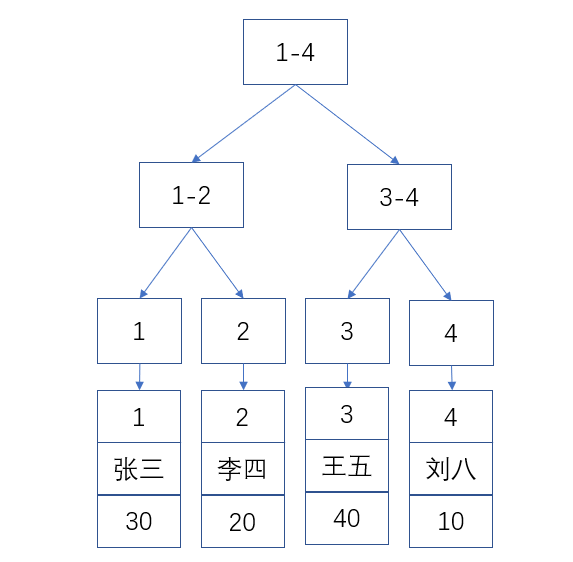
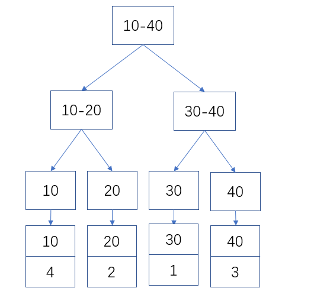

## MySQL 索引详解

### 一、什么是索引

#### 1.1 概念

~~~shell
索引是存储引擎用于快速找到记录的一种数据结构.
~~~

#### 1.2 索引分类

* 从存储结构上来划分

  ~~~shell
  1) Btree 索引（B+tree，B-tree)
  2) 哈希索引
  3) full-index 全文索引
  ~~~

* 从应用层次上来划分

  ~~~shell
  1) 普通索引：即一个索引只包含单个列，一个表可以有多个单列索引。
  2) 唯一索引：索引列的值必须唯一，但允许有空值。
  3) 复合索引：一个索引包含多个列。
  ~~~

* 从表记录的排列顺序和索引的排列顺序是否一致来划分

  ~~~shell
  1) 聚集索引：表记录的排列顺序和索引的排列顺序一致。
  2) 非聚集索引：表记录的排列顺序和索引的排列顺序不一致。
  ~~~

##### 1.2.1 MySQL两大类索引

* 聚集索引

  ~~~shell
  1) 如果表设置了主键，则主键就是聚簇索引
  2) 如果表没有主键，则会默认第一个NOT NULL，且唯一（UNIQUE）的列作为聚簇索引
  3) 以上都没有，则会默认创建一个隐藏的row_id作为聚簇索引
  ~~~

  ~~~shell
  InnoDB的聚簇索引的叶子节点存储的是行记录（其实是页结构，一个页包含多行数据），InnoDB必须要有至少一个聚簇索引。
  由此可见，使用聚簇索引查询会很快，因为可以直接定位到行记录。
  ~~~
* 普通索引

  ~~~shell
  普通索引也叫二级索引，除聚簇索引外的索引，即非聚簇索引。
  InnoDB的普通索引叶子节点存储的是主键（聚簇索引）的值，而MyISAM的普通索引存储的是记录指针。
  ~~~
##### 1.2.2 示例说明
  ~~~shell
mysql> create table user(
            id int(10) auto_increment,
            name varchar(30),
            age tinyint(4),
            primary key (id),
            index idx_age (age)
            )engine=innodb charset=utf8mb4;
  insert into user(name,age) values('张三',30);
  insert into user(name,age) values('李四',20);
  insert into user(name,age) values('王五',40);
  insert into user(name,age) values('刘八',10);
  mysql> select * from user;
  +----+--------+------+
  | id | name   | age  |
  +----+--------+------+
  |  1 | 张三   |   30 |
  |  2 | 李四   |   20 |
  |  3 | 王五   |   40 |
  |  4 | 刘八   |   10 |
  +----+--------+------+
  
 # id 字段是聚簇索引，age 字段是普通索引（二级索引）
  ~~~

*  聚簇索引存储结构

  > id 是主键，所以是聚簇索引，其叶子节点存储的是对应行记录的数据

  

* 聚簇索引查找过程

  ~~~shell
  如果查询条件为主键（聚簇索引），则只需扫描一次B+树即可通过聚簇索引定位到要查找的行记录数据。
  ~~~

* 普通索引存储结构

  > 非聚簇索引,叶子节点存储的是聚簇索引的的值
  
  
  
* 普通索引查找过程

  ~~~shell
    如果查询条件为普通索引（非聚簇索引），需要扫描两次B+树，第一次扫描通过普通索引定位到聚簇索引的值，然后第二次扫描通过聚簇索引的值定位到要查找的行记录数据。 
    如：select * from user where age = 30;
    1) 先通过普通索引 age=30 定位到主键值 id=1
    2) 再通过聚集索引 id=1 定位到行记录数据
  ~~~

#### 1.3 索引介绍

* B-tree

  **存储结构图：**

  

~~~shell
  每个节点占用一个盘块的磁盘空间，一个节点上有两个升序排序的关键字和三个指向子树根节点的指针，指针存储的是子节点所在磁盘块的地址。两个关键词划分成的三个范围域对应三个指针指向的子树的数据的范围域。以根节点为例，关键字为17和35，P1指针指向的子树的数据范围为小于17，P2指针指向的子树的数据范围为17~35，P3指针指向的子树的数据范围为大于35.
~~~

* B+tree

  ~~~shell
  B+Tree是在B-Tree基础上的一种优化，InnoDB存储引擎就是用B+Tree实现其索引结构。
    在B+Tree中，所有数据记录节点都是按照键值大小顺序存放在同一层的叶子节点上，而非叶子节点上只存储key值信息，这样可以大大加大每个节点存储的key值数量，降低B+Tree的高度。
  ~~~

  **存储结构图：**

  

#### 1.4 索引的作用

* 优点

  ~~~shell
  1) 减少查询需要扫描的数据量(加快了查询速度).
  2) 减少服务器的排序操作和创建临时表的操作(加快了groupby和orderby等操作).
  3) 将服务器的随机IO变为顺序IO(加快查询速度).
  ~~~

* 缺点

  >   索引也是数据,也需要存储,因此会带来额外的存储空间占用.其次,在插入,更新和删除操作的同时,需要维护索引,因此会带来额外的时间开销.

  ~~~shell
  1) 索引占用磁盘或者内存空间
  2) 减慢了插入更新操作的速度
  ~~~

  

#### 1.5 索引建立原则

~~~shell
1) 最左前缀匹配原则，非常重要的原则，mysql会一直向右匹配直到遇到范围查询(>、<、between、like)就停止匹配，比如a = 1 and b = 2 and c > 3 and d = 4 如果建立(a,b,c,d)顺序的索引，d是用不到索引的，如果建立(a,b,d,c)的索引则都可以用到，a,b,d的顺序可以任意调整。
2) =和in可以乱序，比如a = 1 and b = 2 and c = 3 建立(a,b,c)索引可以任意顺序，mysql的查询优化器会帮你优化成索引可以识别的形式。
3) 尽量选择区分度高的列作为索引，区分度的公式是count(distinct col)/count(*)，表示字段不重复的比例，比例越大我们扫描的记录数越少，唯一键的区分度是1，而一些状态、性别字段可能在大数据面前区分度就是0，那可能有人会问，这个比例有什么经验值吗？使用场景不同，这个值也很难确定，一般需要join的字段我们都要求是0.1以上，即平均1条扫描10条记录。
4) 索引列不能参与计算，保持列“干净”，比如from_unixtime(create_time) = ’2014-05-29’就不能使用到索引，原因很简单，b+树中存的都是数据表中的字段值，但进行检索时，需要把所有元素都应用函数才能比较，显然成本太大。所以语句应该写成create_time = unix_timestamp(’2014-05-29’)。
5) 尽量的扩展索引，不要新建索引。比如表中已经有a的索引，现在要加(a,b)的索引，那么只需要修改原来的索引即可。
~~~

* 前缀索引

  ~~~shell
    在对一个比较长的字符串进行索引时,可以仅索引开始的一部分字符,这样可以大大的节约索引空间,从而提高索引效率.但是这样也会降低索引的选择性。
  ~~~

  **原则**

  ~~~shell
  降低重复的索引值
  ~~~

  **样例**

  | area           | gdp  | code |
  | -------------- | ---- | ---- |
  | chinaShanghai  | 100  | 1    |
  | chinaDalian    | 200  | 2    |
  | chinahenan     | 300  | 3    |
  | usaNewYork     | 400  | 4    |
  | chinabeijing   | 500  | 5    |
  | chinaguangdong | 600  | 6    |

  我们可以发现以上表中'area'列字段很多都是以china开头的，如果我们以前1-5位字符做前缀索引就会出现大量索引值重复的情况，索引值重复性越低 查询效率也就越高。

  **语法**

  ~~~mysql
  ALTER TABLE table_name ADD KEY(column_name(prefix_length));
  ~~~

* 联合索引

  ~~~shell
    一般我们都是有对多个列进行索引的需求的,因为查询的需求多种多样.这个时候我们可以选择建立多个独立的索引或者建立一个联合索引.大多数时候都是联合索引更加合适一些.
    
    执行这个语句:select * from user where school_name = '卡塞尔' and age > 20,我们在school和age上分别建立两个独立的索引,那么我们预期这条查询语句会命中两个索引,但是使用explain命令查看会发现不一定。
  ~~~

  **语法**

  ~~~shell
  alter table user add index school_age(`school`,`age`)
  ~~~

  注意：

    使用联合索引的时候,有一个非常重要的因素就是所有的索引列只可以进行最左前缀匹配,例如上面的`school_age`联合索引,当仅使用age作为查询条件的时候是不能使用的,也就是说`select * from user where age =20`是不能命中上面的联合索引的.

* ### 聚簇索引

  ~~~shell
  聚簇索引不是一种索引类型,而是一种存储数据的方式.Innodb的聚簇索引是在同一个数据结构中保存了索引和数据.
    Innodb使用主键来进行聚簇索引,没有主键的话就会选择一个唯一的非空索引,如果还还没有,innodb会选择生成一个隐式的主键来进行聚簇索引.为什么innodb这么执着的需要搞一个聚簇索引呢,因为一个数据表中的数据总得有且只有一种排序方式来存储在磁盘上,因此这是必须的.
  ~~~

* 覆盖索引

  ~~~shell
  当一个索引包含(或者说是覆盖)需要查询的所有字段的值时,我们称之为覆盖索引.
  ~~~

  ~~~mysql
  select 
    school_name,age
  from  
    user
  where 
    school_name = '金色莺尾花学院'
  
    这个语句根据学校名称来查询数据行的学校名称和年龄,从上面的数据查询的步骤我们可以知道,当在索引中找到要求的值的时候,还需要根据主键去进行一次索引,以拿到全部的数据,然后从其中挑选出需要的列,返回.但是现在索引中已经包含了所有的需要返回的列,那么就不用进行回数据表查询的操作了,此外索引的大小一般是远远小于真正的数据大小的,覆盖索引可以极大的减少从磁盘加载数据的数量.
  
  ~~~

### 二、索引执行计划

#### 2.1 explain

~~~shell
  explain为mysql提供语句的执行计划信息。可以应用在select、delete、insert、update和place语句上。explain的执行计划，只是作为语句执行过程的一个参考，实际执行的过程不一定和计划完全一致，但是执行计划中透露出的信息却可以帮助选择更好的索引和写出更优化的查询语句。
~~~

**explain输出项**

~~~mysql
mysql> explain select * from t20 where area = 'chinaxjhmfy';
+----+-------------+-------+------------+------+---------------+------+---------+------+--------+----------+-------------+
| id | select_type | table | partitions | type | possible_keys | key  | key_len | ref  | rows   | filtered | Extra       |
+----+-------------+-------+------------+------+---------------+------+---------+------+--------+----------+-------------+
|  1 | SIMPLE      | t20   | NULL       | ALL  | NULL          | NULL | NULL    | NULL | 309086 |    10.00 | Using where |
+----+-------------+-------+------------+------+---------------+------+---------+------+--------+----------+-------------+
~~~

* id

  ~~~shell
  id列的编号是 select 的序列号，有几个 select 就有几个id，并且id的顺序是按 select 出现的顺序增长的。
  MySQL将 select 查询分为简单查询(SIMPLE)和复杂查询(PRIMARY)。复杂查询分为三类：简单子查询、派生表（from语句中的子查询）、union 查询。
  ~~~

* #### select_type

  ~~~shell
  表示对应行是简单还是复杂的查询
  ~~~

* table 正在访问哪个表

  ~~~shell
    当 from 子句中有子查询时，table列是  格式，表示当前查询依赖 id=N 的查询，于是先执行 id=N 的查询。
  当有 union 时，UNION RESULT 的 table 列的值为<union1, 2>，1和2表示参与 union 的 select 行id。
  
  ~~~

* #### partitions

  ~~~shell
  
  ~~~

* #### type

  ~~~shell
  这一列表示关联类型或访问类型，即MySQL决定如何查找表中的行，查找数据行记录的大概范围。
  依次从最优到最差分别为：system > const > eq_ref > ref > range > index > ALL
  # 1) const system
   mysql能对查询的某部分进行优化并将其转化成一个常量（可以看show warnings 的结果）。用于 primary key 或 unique key 的所有列与常数比较时，所以表最多有一个匹配行，读取1次，速度比较快。system是const的特例，表里只有一条元组匹配时为system
  # 2) eq_ref
    primary key 或 unique key 索引的所有部分被连接使用 ，最多只会返回一条符合条件的记录。这可能是在 const 之外最好的联接类型了，简单的 select 查询不会出现这种 type。
  # 3) ref
    相比 eq_ref，不使用唯一索引，而是使用普通索引或者唯一性索引的部分前缀，索引要和某个值相比较，可能会找到多个符合条件的行
  # 4) range
    范围扫描通常出现在 in(), between , > , <, >= 等操作中。使用一个索引来检索给定范围的行。
  # 5) index 
    扫描全表索引，这通常比ALL快一些。（index是从索引中读取的，而all是从硬盘中读取）
  # 6) ALL
    即全表扫描，不走索引。
  ~~~

* #### possible_keys  可能使用的索引

  ~~~shell
    explain 时可能出现 possible_keys 有列，而 key 显示 NULL 的情况，这种情况是因为表中数据不多，mysql认为索引对此查询帮助不大，选择了全表查询。
    如果该列是NULL，则没有相关的索引。在这种情况下，可以通过检查 where 子句看是否可以创造一个适当的索引来提高查询性能，然后用 explain 查看效果。
  ~~~

* key 

  ~~~shell
  表示mysql实际采用哪个索引来优化对该表的访问。
  如果没有使用索引，则该列是 NULL。如果想强制mysql使用或忽视possible_keys列中的索引，在查询中使用 force index、ignore index。
  ~~~

* #### key_len

  ~~~shell
  这一列显示了mysql在索引里使用的字节数，通过这个值可以算出具体使用了索引中的哪些列。
  ~~~

* #### ref

  ~~~shell
  这一列显示了在key列记录的索引中，表查找值所用到的列或常量，常见的有：const（常量），字段名（例：film. id
  ~~~

* #### rows

  ~~~shell
  这一列是mysql估计要读取并检测的行数，注意这个不是结果集里的行数。
  ~~~

* #### filtered

  ~~~shell
    5.7之后的版本默认就有这个字段，不需要使用explain extended了。这个字段表示存储引擎返回的数据在server层过滤后，剩下多少满足查询的记录数量的比例，注意是百分比，不是具体记录数。
  ~~~

* #### Extra

  ~~~shell
  1) Using index：查询的列被索引覆盖，并且where筛选条件是索引的前导列(最左侧索引)，是性能高的表现。一般是使用了覆盖索引(索引包含了所有查询的字段)。对于innodb来说，如果是辅助索引性能会有不少提高。
  
  2) Using where：查询的列未被索引覆盖，where筛选条件非索引的前导列。
  
  3) Using where Using index：查询的列被索引覆盖，并且where筛选条件是索引列之一但不是索引的前导列，意味着无法直接通过索引查找来查询到符合条件的数据, Using index代表select用到了覆盖索引。
  
  4) NULL：查询的列未被索引覆盖，并且where筛选条件是索引的前导列，意味着用到了索引，但是部分字段未被索引覆盖，必须通过“回表”来实现，不是纯粹地用到了索引，也不是完全没用到索引。
  
  5) Using index condition：与Using where类似，查询的列不完全被索引覆盖，where条件中是一个前导列的范围；
  
  6) Using temporary：mysql需要创建一张临时表来处理查询。出现这种情况一般是要进行优化的，首先是想到用索引来优化。
  
  7) Using filesort：mysql 会对结果使用一个外部索引排序，而不是按索引次序从表里读取行。此时mysql会根据联接类型浏览所有符合条件的记录，并保存排序关键字和行指针，然后排序关键字并按顺序检索行信息。这种情况下一般也是要考虑使用索引来优化的。
  ~~~

#### 2.2 索引优化器

~~~shell
# 查看内置优化器
mysql> select @@optimizer_switch;
| @@optimizer_switch                                                                                |
| index_merge=on,
index_merge_union=on,
index_merge_sort_union=on,
index_merge_intersection=on,
engine_condition_pushdown=on,
index_condition_pushdown=on,
mrr=on,
mrr_cost_based=on,
block_nested_loop=on,
batched_key_access=off,
materialization=on,
semijoin=on,
loosescan=on,
firstmatch=on,
duplicateweedout=on,
subquery_materialization_cost_based=on,
use_index_extensions=on,
condition_fanout_filter=on,
derived_merge=on |

~~~

##### 2.2.1 索引下推 

> 参考文档：https://mariadb.com/kb/en/index-condition-pushdown/

~~~shell
  Index Condition Pushdown 简称ICP，中文名：索引下推，是mysql利用索引（二级索引）元组和筛字段在索引中的where条件从表中提取数据记录的一种优化操作。
  不使用索引条件下推优化时存储引擎通过索引检索到数据，然后返回给MySQL服务器，服务器然后判断数据是否符合条件。当使用索引条件下推优化时，如果存在某些被索引的列的判断条件时，MySQL服务器将这一部分判断条件传递给存储引擎，然后由存储引擎通过判断索引是否符合MySQL服务器传递的条件，只有当索引符合条件时才会将数据检索出来返回给MySQL服务器。索引条件下推优化可以减少存储引擎查询基础表的次数，也可以减少MySQL服务器从存储引擎接收数据的次数。
~~~

**适用条件**

~~~shell
1) 需要整表扫描的情况: range, ref, eq_ref, ref_or_null
2) 对于InnDB引擎只适用于二级索引，因为InnDB的聚簇索引会将整行数据读到InnDB的缓冲区，这样一来索引条件下推的主要目的减少IO次数就失去了意义。因为数据已经在内存中了，不再需要去读取了。
3) 引用子查询的条件不能下推。
4) 调用存储过程的条件不能下推，存储引擎无法调用位于MySQL服务器中的存储过程。
5) 触发条件不能下推。
~~~

例子：

~~~mysql
SELECT * FROM people
  WHERE zipcode='95054'
  AND lastname LIKE '%etrunia%'
  AND address LIKE '%Main Street%';
  
  说明: 
  people表中（zipcode，lastname，firstname）构成一个索引.
  如果没有使用索引下推技术，则MySQL会通过zipcode='95054'从存储引擎中查询对应的元祖，返回到MySQL服务端，然后MySQL服务端基于lastname LIKE '%etrunia%'和address LIKE '%Main Street%'来判断元祖是否符合条件。
  如果使用了索引下推技术，则MYSQL首先会返回符合zipcode='95054'的索引，然后根据lastname LIKE '%etrunia%'和address LIKE '%Main Street%'来判断索引是否符合条件。如果符合条件，则根据该索引来定位对应的元祖，如果不符合，则直接reject掉。
~~~

事例总结说明：

~~~shell
# 关闭ICP
  根据（zipcode，lastname，firstname）联合索引查询所有满足名称zipcode='95054'的索引，然后回表查询出相应的全行数据，然后再筛选出lastname LIKE '%etrunia%'和address LIKE '%Main Street%'的数据。
# 开启ICP
  根据（zipcode，lastname，firstname）联合索引查询符合zipcode='95054'的索引，然后直接再筛选出lastname LIKE '%etrunia%'和address LIKE '%Main Street%'的索引匹配的数据，之后再回表查询全行数据。
~~~

* 配置

  ~~~mysql
  # 索引下推优化是默认开启的。可以通过下面的脚本控制开关
  SET optimizer_switch = 'index_condition_pushdown=off';  -- 关闭
  SET optimizer_switch = 'index_condition_pushdown=on';   -- 打开
  ~~~

**解决问题**

~~~shell
联合索引只能部分应用的情况。
减少没必要的数据也被扫描，将不走索引的条件，在engine层取数据之前先做二次过滤，一些无关数据就会提前过滤掉。
~~~

**总结**

~~~shell
  索引下推优化技术其实就是充分利用了索引中的数据，尽量在查询出整行数据之前过滤掉无效的数据。由于需要存储引擎将索引中的数据与条件进行判断，所以这个技术是基于存储引擎的，只有特定引擎可以使用。并且判断条件需要是在存储引擎这个层面可以进行的操作才可以，比如调用存储过程的条件就不可以，因为存储引擎没有调用存储过程的能力。
~~~

思考：查询条件不一样？

~~~mysql
create table t1(
	empno smallint(5) unsigned not null auto_increment,
	ename varchar(30) not null,
	deptno smallint(5) unsigned not null,
	job varchar(30) not null,
	primary key(empno),
	key idx_emp_info(deptno,ename)
)engine=InnoDB charset=utf8;

insert into t1 values(1,'zhangsan',1,'CEO'),(2,'lisi',2,'CFO'),(3,'wangwu',3,'CTO'),(4,'jeanron100',3,'Enginer');
# 查询1
select * from t1 where deptno between 1 and 100 and ename ='jeanron100';  -- 不会索引下推
# 查询2
select * from t1 where deptno between 10 and 3000 and ename ='jeanron100'; -- 索引下推
# 查询3
select * from t1 where ename like "%z%" deptno between 10 and 3000;   -- 索引下推
~~~

##### 2.2.2 Nested Loop Join

~~~shell
# NLJ 定义
  将外层表的结果集作为循环的基础数据，然后循环从该结果集每次一条获取数据作为下一个表的过滤条件去查询数据，然后合并结果。如果有多个表join，那么应该将前面的表的结果集作为循环数据，取结果集中的每一行再到下一个表中继续进行循环匹配，获取结果集并返回给客户端。
~~~

~~~mysql
#伪代码
for each row in t1 matching range {
  for each row in t2 matching reference key {
     for each row in t3 {
      if row satisfies join conditions,
      send to client
    }
  }
 }
 
 # 总结：普通的Nested-Loop Join算法一次只能将一行数据传入内存循环，所以外层循环结果集有多少行，那么内存循环就要执行多少次。
~~~

##### 2.2.3 Block Nested-Loop

~~~shell
简称BNL，原理：将外层循环的行/结果集存入join buffer，内存循环的每一行数据与整个buffer中的记录做比较，可以减少内层循环的扫描次数。主要用于当被join的表上无索引。
例如：外层循环结果集有1000行数据，使用NLJ算法需要扫描内层表1000次，但如果使用BNL算法，则先取出外层表结果集的100行存放到join buffer, 然后用内层表的每一行数据去和这100行结果集做比较，可以一次性与100行数据进行比较，这样内层表其实只需要循环1000/100=10次，减少了9/10。
~~~

**参数控制**

~~~mysql
SET optimizer_switch=’block_nested_loop=on’;
~~~

##### 2.2.4 MRR

~~~shell
# 介绍
  MRR 的全称是 Multi-Range Read Optimization，优化二级索引的范围扫描并且需要回表的情况，将多个需要回表的二级索引根据主键进行排序，然后一起回表，将原来的随机IO转化为顺序IO以降低查询过程中IO开销的一种手段，这对IO-bound类型的SQL语句性能带来极大的提升，适用于range ref eq_ref类型的查询。
~~~

**执行过程**

~~~shell
  在不使用 MRR 时，优化器需要根据二级索引返回的记录来进行“回表”，这个过程一般会有较多的随机IO, 使用MRR时，SQL语句的执行过程是这样的：
1) 优化器将二级索引查询到的记录放到一块缓冲区中
2) 如果二级索引扫描到文件的末尾或者缓冲区已满，则使用快速排序对缓冲区中的内容按照主键进行排序
3) 用户线程调用MRR接口取cluster index，然后根据cluster index 取行数据
4) 当根据缓冲区中的 cluster index取完数据，则继续调用过程 2) 3)，直至扫描结束
通过上述过程，优化器将二级索引随机的 IO 进行排序，转化为主键的有序排列，从而实现了随机 IO 到顺序 IO 的转化，提升性能.
~~~

**简化流程**

~~~
关闭mrr: 辅助索引 --> 回表 --> 聚簇索引  # 随机io
启用mrr: 辅助索引 --> sort id --> 回表 --> 聚簇索引 #顺序io
~~~

**参数控制**

~~~mysql
mrr=on,mrr_cost_based=on，则表示cost base的方式还选择启用MRR优化,当发现优化后的代价过高时就会不使用该项优化
mrr=on,mrr_cost_based=off，则表示总是开启MRR优化
SET  @@optimizer_switch='mrr=on,mrr_cost_based=on';
~~~

##### 2.2.5 BKA

~~~shell
# 介绍
  Batched Key Access (BKA) 是提高表join性能的算法。当被join的表能够使用索引时，就先排好顺序，然后再去检索被join的表，听起来和MRR类似，实际上MRR也可以想象成二级索引和 primary key的join，如果被Join的表上没有索引，则使用老版本的BNL策略(BLOCK Nested-loop)。
# 原理
  对于多表join语句，当MySQL使用索引访问第二个join表的时候，使用一个join buffer来收集第一个操作对象生成的相关列值。BKA构建好key后，批量传给引擎层做索引查找。key是通过MRR接口提交给引擎的（mrr目的是较为顺序）MRR使得查询更有效率。
~~~

**执行过程**

~~~shell
1) BKA使用join buffer保存由join的第一个操作产生的符合条件的数据。
2) 然后BKA算法构建key来访问被连接的表，并批量使用MRR接口提交keys到数据库存储引擎去查找查找。
3) 提交keys之后，MRR使用最佳的方式来获取行并反馈给BKA。
~~~

**参数控制**

~~~shell
  BAK使用了MRR，要想使用BAK必须打开MRR功能，而MRR基于mrr_cost_based的成本估算并不能保证总是使用MRR，官方推荐设置mrr_cost_based=off来总是开启MRR功能。打开BAK功能(BAK默认OFF)：
SET optimizer_switch='mrr=on,mrr_cost_based=off,batched_key_access=on';
~~~

### 三、补充

### 3.1 BNL和BKA区别

~~~shell
BNL和BKA都是批量的提交一部分行给被join的表，从而减少访问的次数，那么它们有什么区别呢？
1) BNL比BKA出现的早，BKA直到5.6才出现，而NBL至少在5.1里面就存在。
2) BNL主要用于当被join的表上无索引
3) BKA主要是指在被join表上有索引可以利用，那么就在行提交给被join的表之前，对这些行按照索引字段进行排序，因此减少了随机IO，排序这才是两者最大的区别，但是如果被join的表没用索引呢？那就使用NBL
~~~

### 3.2 回表

~~~mysql
# 介绍
  先通过普通索引的值定位聚簇索引值，再通过聚簇索引的值定位行记录数据，需要扫描两次索引B+树，它的性能较扫一遍索引树更低。
~~~

~~~shell
# 造数据
mysql> create table user(
     id int(10) auto_increment,
     name varchar(30),
     age tinyint(4),
     primary key (id),
     index idx_age (age)
     )engine=innodb charset=utf8mb4;
  # id 字段是聚簇索引，age 字段是普通索引（二级索引）  
# 插入数据
insert into user(name,age) values('张三',30);
insert into user(name,age) values('李四',20);
insert into user(name,age) values('王五',40);
insert into user(name,age) values('刘八',10);

mysql> select * from user;
+----+--------+------+
| id | name   | age  |
+----+--------+------+
|  1 | 张三   |   30 |
|  2 | 李四   |   20 |
|  3 | 王五   |   40 |
|  4 | 刘八   |   10 |
+----+--------+------+

~~~

**普通索引查询过程**

~~~mysql
select * from t where name='王五';　
1) 先通过普通索引name='王五'定位到主键值id=3;
2) 在通过聚集索引id=3定位到行记录;

# 总结：这就是回表查询，先定位主键值，再定位行记录，它的性能较扫一遍索引树更低
~~~

**回表查询避免**

* 覆盖索引

  ~~~shell
  select id,age from user where age = 10;
  只需要在一棵索引树上就能获取SQL所需的所有列数据，无需回表，速度更快。
  ~~~

* 覆盖索引实现

  ~~~shell
  将被查询的字段，建立到联合索引里去
  1) select id,age from user where age = 10;
  mysql> desc select id,name,age from user where age = 10;
  +----+-------------+-------+------------+------+---------------+---------+---------+-------+------+----------+-------+
  | id | select_type | table | partitions | type | possible_keys | key     | key_len | ref   | rows | filtered | Extra |
  +----+-------------+-------+------------+------+---------------+---------+---------+-------+------+----------+-------+
  |  1 | SIMPLE      | user  | NULL       | ref  | idx_age       | idx_age | 2       | const |    1 |   100.00 | NULL  |
  +----+-------------+-------+------------+------+---------------+---------+---------+-------+------+----------+-------+
  
  分析：因为age是普通索引，使用到了age索引，通过一次扫描B+树即可查询到相应的结果，这样就实现了覆盖索引。
  2) select id,age,name from user where age = 10;
  mysql> desc select id,age from user where age = 10;
  +----+-------------+-------+------------+------+---------------+---------+---------+-------+------+----------+-------------+
  | id | select_type | table | partitions | type | possible_keys | key     | key_len | ref   | rows | filtered | Extra       |
  +----+-------------+-------+------------+------+---------------+---------+---------+-------+------+----------+-------------+
  |  1 | SIMPLE      | user  | NULL       | ref  | idx_age       | idx_age | 2       | const |    1 |   100.00 | Using index |
  +----+-------------+-------+------------+------+---------------+---------+---------+-------+------+----------+-------------+
  分析：age是普通索引，但name列不在索引树上，所以通过age索引在查询到id和age的值后，需要进行回表再查询name的值。此时的Extra列的NULL表示进行了回表查询。
  # 针对于第二种情况，创建联合索引
  drop index idx_age on user;
  create index idx_age_name on user(`age`,`name`);
  mysql> desc select id,age from user where age = 10;
  +----+-------------+-------+------------+------+---------------+--------------+---------+-------+------+----------+-------------+
  | id | select_type | table | partitions | type | possible_keys | key          | key_len | ref   | rows | filtered | Extra       |
  +----+-------------+-------+------------+------+---------------+--------------+---------+-------+------+----------+-------------+
  |  1 | SIMPLE      | user  | NULL       | ref  | idx_age_name  | idx_age_name | 2       | const |    1 |   100.00 | Using index |
  +----+-------------+-------+------------+------+---------------+--------------+---------+-------+------+----------+-------------+
  分析：此时字段age和name是组合索引idx_age_name，查询的字段id、age、name的值刚刚都在索引树上，只需扫描一次组合索引B+树即可，这就是实现了索引覆盖，此时的Extra字段为Using index表示使用了索引覆盖。
  ~~~

  * 索引覆盖应用场景

    ~~~shell
    1) 全表count查询优化
    mysql> create table user(
         id int(10) auto_increment,
         name varchar(30),
         age tinyint(4),
         primary key (id),
        )engine=innodb charset=utf8mb4;
    
    select count(name) from user;
    解决：创建name字段索引
    2) 列查询回表优化
    3) 分页查询
    select id,age,name from user order by age limit 100,2;
    因为name字段不是索引，所以在分页查询需要进行回表查询，此时Extra为Using filesort文件排序，查询性能低下。
    解决：建组合索引idx_age_name(age,name)
    ~~~

### 3.3  key_len计算

~~~shell
# 计算公式
varchr(10)变长字段且允许NULL      : 10*(Character Set：utf8=3,gbk=2,latin1=1)+1(NULL)+2(变长字段)
varchr(10)变长字段且不允许NULL    : 10*(Character Set：utf8=3,gbk=2,latin1=1)+2(变长字段)
char(10)固定字段且允许NULL        : 10*(Character Set：utf8=3,gbk=2,latin1=1)+1(NULL)
char(10)固定字段且不允许NULL      : 10*(Character Set：utf8=3,gbk=2,latin1=1)
~~~

**示例：**

| 列类型                         | key-len          | 备注                                                         |
| ------------------------------ | ---------------- | ------------------------------------------------------------ |
| id int                         | key_len = 4+1    | int为4bytes,允许为NULL,加1byte                               |
| id bigint not null             | key_len=8        | bigint为8bytes                                               |
| user char(30) utf8             | key_len=30*3+1   | utf8每个字符为3bytes,允许为NULL,加1byte                      |
| user varchar(30) not null utf8 | key_len=30*3+2   | utf8每个字符为3bytes,变长数据类型,加2bytes                   |
| user varchar(30) utf8          | key_len=30*3+2+1 | utf8每个字符为3bytes,允许为NULL,加1byte,变长数据类型,加2bytes |
| detail text(10) utf8           | key_len=30*3+2+1 | TEXT截取部分,被视为动态列类型                                |

**总结**

~~~shell
1) 索引字段的附加信息:可以分为变长和定长数据类型讨论，当索引字段为定长数据类型时,如char，int，datetime,需要有是否为空的标记,这个标记占用1个字节(对于not null的字段来说,则不需要这1字节);对于变长数据类型,比如varchar,除了是否为空的标记外,还需要有长度信息,需要占用两个字节。
2) 对于,char、varchar、blob、text等字符集来说，key len的长度还和字符集有关,latin1一个字符占用1个字节,gbk一个字符占用2个字节,utf8一个字符占用3个字节。
~~~

