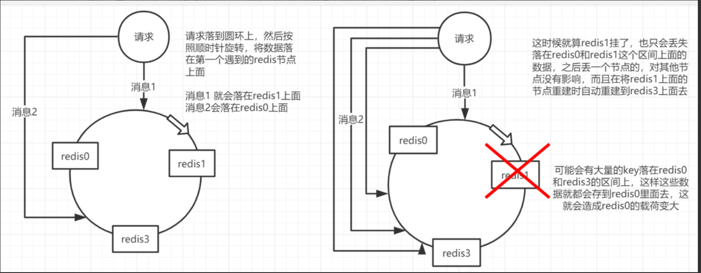

## Redis 集群部署

### 一、单机部署

#### 1.1 下载解压

> 下载地址：http://download.redis.io/releases/

~~~shell
[root@db20 ~]# wget http://download.redis.io/releases/redis-4.0.14.tar.gz
[root@db20 ~]# tar -xf redis-4.0.14.tar.gz 
~~~

#### 1.2 编译安装

~~~shell
[root@db20 ~]# yum -y install gcc gcc-c++ libstdc++-devel
[root@db20 ~]# cd redis-4.0.14
[root@db20 ~]# make MALLOC=libc
[root@db20 ~]# make install PREFIX=/opt/redis/6379
~~~

#### 1.3 命令工具

~~~shell
[root@db20 ~]# ll /opt/redis/3306/bin/
redis-benchmark				-- redis 基准测试工具
redis-check-aof				-- redis AOF 持久化文件检测和修复工具
redis-check-rdb				-- redis RDB 持久化文件检测和修复工具
redis-cli				    -- 命令行客户端
redis-sentinel 				-- 启动 redis sentinel
redis-server				-- 启动 redis 服务
~~~

#### 1.4 配置文件编辑

~~~shell
[root@db20 ~]# mkdir -p /opt/redis/6379/{conf,data,logs}
[root@db20 ~]# cp redis-4.0.14/redis.conf /opt/redis/3306/conf/
# 主要修改以下参数
daemonize yes  以守护进程的方式运行，docker运行时，修改为no
logfile /opt/redis/6379/logs/redis.log
dir "/opt/redis/6379/data"
requirepass "123456"
~~~

* 配置文件主要参数详解

  ~~~shell
  # redis进程是否以守护进程的方式运行，yes为是，no为否(不以守护进程的方式运行会占用一个终端)。
  daemonize no
  # 指定redis进程的PID文件存放位置
  pidfile /var/run/redis.pid
  # redis进程的端口号
  port 6379
  # 绑定的主机地址
  bind 127.0.0.1
  # 客户端闲置多长时间后关闭连接，默认此参数为0即关闭此功能
  timeout 300
  # redis日志级别，可用的级别有debug.verbose.notice.warning
  loglevel verbose
  # log文件输出位置，如果进程以守护进程的方式运行，此处又将输出文件设置为stdout的话，就会将日志信息输出到/dev/null里面去了
  logfile stdout
  # 设置数据库的数量，默认为0可以使用select <dbid>命令在连接上指定数据库id
  databases 16
  # 指定在多少时间内刷新次数达到多少的时候会将数据同步到数据文件
  save <seconds> <changes>
  # 指定存储至本地数据库时是否压缩文件，默认为yes即启用存储
  rdbcompression yes
  # 指定本地数据库文件名
  dbfilename dump.db
  # 指定本地数据问就按存放位置
  dir ./
  # 指定当本机为slave服务时，设置master服务的IP地址及端口，在redis启动的时候他会自动跟master进行数据同步
  slaveof <masterip> <masterport>
  # 当master设置了密码保护时，slave服务连接master的密码
  masterauth <master-password>
  # 设置redis连接密码，如果配置了连接密码，客户端在连接redis是需要通过AUTH<password>命令提供密码，默认关闭
  requirepass footbared
  # 设置同一时间最大客户连接数，默认无限制。redis可以同时连接的客户端数为redis程序可以打开的最大文件描述符，如果设置 maxclients 0，表示不作限制。当客户端连接数到达限制时，Redis会关闭新的连接并向客户端返回 max number of clients reached 错误信息
  maxclients 128
  # 指定Redis最大内存限制，Redis在启动时会把数据加载到内存中，达到最大内存后，Redis会先尝试清除已到期或即将到期的Key。当此方法处理后，仍然到达最大内存设置，将无法再进行写入操作，但仍然可以进行读取操作。Redis新的vm机制，会把Key存放内存，Value会存放在swap区
  maxmemory<bytes>
  # 指定是否在每次更新操作后进行日志记录，Redis在默认情况下是异步的把数据写入磁盘，如果不开启，可能会在断电时导致一段时间内的数据丢失。因为redis本身同步数据文件是按上面save条件来同步的，所以有的数据会在一段时间内只存在于内存中。默认为no。
  appendonly no
  # 指定跟新日志文件名默认为appendonly.aof
  appendfilename appendonly.aof
  # 指定更新日志的条件，有三个可选参数 - no：表示等操作系统进行数据缓存同步到磁盘(快)，always：表示每次更新操作后手动调用fsync()将数据写到磁盘(慢，安全)， everysec：表示每秒同步一次(折衷，默认值)；
  appendfsync everysec
  ~~~

#### 1.5 添加系统服务

~~~shell
[root@db20 ~]# vim /usr/lib/systemd/system/redis.service
[Unit]
Description=Redis
After=syslog.target network.target remote-fs.target nss-lookup.target

[Service]
Type=forking
ExecStart=/opt/redis/6379/bin/redis-server /opt/redis/6379/conf/redis.conf
ExecReload=/bin/kill -s HUP $MAINPID
ExecStop=/bin/kill -s QUIT $MAINPID
PrivateTmp=true

[Install]
WantedBy=multi-user.target

[root@db20 ~]# systemctl enable redis
[root@db20 ~]# systemctl start redis
[root@db20 ~]# netstat -nlpt
tcp        0      0 127.0.0.1:6379          0.0.0.0:*               LISTEN      2510/redis-server 1
~~~

### 二、主从

#### 2.1 机器分配

| 角色   | ip           | 端口 |
| ------ | ------------ | ---- |
| Master | 172.16.10.20 | 6379 |
| Slave1 | 172.16.10.21 | 6379 |
| Slave2 | 172.16.10.21 | 6379 |

#### 2.2 复制过程

~~~shell
1）当一个从数据库启动时，会向主数据库发送sync命令，
2）主数据库接收到sync命令后会开始在后台保存快照（执行rdb操作），并将保存期间接收到的命令缓存起来
3）当快照完成后，redis会将快照文件和所有缓存的命令发送给从数据库。
4）从数据库收到后，会载入快照文件并执行收到的缓存的命令。
~~~

#### 2.3 配置文件

* Master 节点

~~~shell
# Master 节点
[root@db20 ~]# vim /opt/redis/6379/conf/redis.conf 
bind 172.16.10.20    -- 或者修改为0.0.0.0
~~~

* 从节点

~~~shell
# 从节点 21
[root@db21 ~]# vim /opt/redis/6379/conf/redis.conf 
bind 172.16.10.21
slaveof 172.16.10.20 6379

# 从节点22
[root@db22 ~]# vim /opt/redis/6379/conf/redis.conf 
bind 172.16.10.22
slaveof 172.16.10.20 6379

~~~

#### 3.4 启动

~~~shell
# 启动命令三台节点一样
[root@db20 ~]# cd /opt/redis/6379/bin/
[root@db20 bin]# ./redis-server /opt/redis/6379/conf/redis.conf 
[root@db20 bin]# ps -ef|grep redis
root       2846      1  0 17:36 ?        00:00:00 ./redis-server 172.16.10.20:6379
~~~

#### 3.5 查看状态

**主服务器**

~~~shell
# 主服务器
[root@db20 bin]# ./redis-cli -h 172.16.10.20  -- 使用监听ip登录
172.16.10.20:6379> INFO
.......
# Replication
role:master			-- 节点在集群中的角色
connected_slaves:2	 -- slave节点的个数
slave0:ip=172.16.10.21,port=6379,state=online,offset=644,lag=1
slave1:ip=172.16.10.22,port=6379,state=online,offset=644,lag=0
master_replid:43a4356b7b64c8c3994a66de01683f8f2a1a5864
master_replid2:0000000000000000000000000000000000000000
master_repl_offset:644
second_repl_offset:-1
repl_backlog_active:1
repl_backlog_size:1048576
repl_backlog_first_byte_offset:1
repl_backlog_histlen:644
.......
~~~

**从服务器**

~~~shell
# Replication
role:slave
master_host:172.16.10.20
master_port:6379
master_link_status:up
master_last_io_seconds_ago:1
master_sync_in_progress:0
slave_repl_offset:770
slave_priority:100
slave_read_only:1
connected_slaves:0
master_replid:43a4356b7b64c8c3994a66de01683f8f2a1a5864
master_replid2:0000000000000000000000000000000000000000
master_repl_offset:770
second_repl_offset:-1
repl_backlog_active:1
repl_backlog_size:1048576
repl_backlog_first_byte_offset:1
repl_backlog_histlen:770
~~~

#### 3.6 验证

~~~shell
# 1) 主服务器写入数据
[root@db20 bin]# ./redis-cli -h 172.16.10.20 
172.16.10.20:6379> set user xiaohua
OK
172.16.10.20:6379> get user
"xiaohua"
# 2) 从服务器查看
172.16.10.21:6379> KEYS *
1) "user"
172.16.10.21:6379> GET user
"xiaohua"
~~~

**注意：** 

1、 redis主从复制默认是读写分离的，主节点上可以读写操作；从节点上只能进行读操作，不能写数据。

2、如果 主服务器 设置了密码，还需要找到 masterauth 这一行，去掉注释，改为 masterauth 的主机密码。

3、确保master节点激活了持久化，或者确保它不会在宕掉后自动重启：slave是master的完整备份，因此如果master通过一个空数据集重启，slave也会被清掉。

### 三、哨兵

#### 3.1 基础概念

~~~shell
  Redis Sentinel是Redis高可用的实现方案。Sentinel是一个管理多个Redis实例的工具，它可以实现对Redis的 监控、通知、自动故障转移。
    sentinel可以让redis实现主从复制，当一个集群中的master失效之后，sentinel可以选举出一个新的master用于自动接替master的工作，集群中的其他redis服务器自动指向新的master同步数据。一般建议sentinel采取奇数台，防止某一台sentinel无法连接到master导致误切换。
~~~

#### 3.2 功能

~~~shell
1、监控：不断的检查 主服务器 和 从服务器 是否正常运行。
2、通知：当被监控的某个Redis服务器出现问题，Sentinel通过API脚本向管理员或者其他的应用程序发送通知。
3、自动故障转移：当主节点不能正常工作时，Sentinel会开始一次自动的故障转移操作，它会将与失效主节点是 主从关系的其中一个从节点升级为新的主节点，并且将其他的从节点指向新的主节点。
4、配置提供者：在Redis Sentinel模式下，客户端应用在初始化时连接的是Sentinel节点集合，从中获取主节点 的信息。
~~~

**主观下线**

~~~shell
  主观下线（Subjectively Down， 简称 SDOWN）指的是单个Sentinel实例对服务器做出的下线判断，即单个sentinel认为某个服务下线（有可能是接收不到订阅，之间的网络不通等等原因）。
  主观下线就是说如果服务器在down-after-milliseconds给定的毫秒数之内， 没有返回Sentinel发送的PING 命令的回复， 或者返回一个错误， 那么Sentinel将这个服务器标记为主观下线(SDOWN)。
  sentinel会以每秒一次的频率向所有与其建立了命令连接的实例(master，从服务，其他sentinel)发ping命令，通过判断ping回复是有效回复，还是无效回复来判断实例时候在线（对该sentinel来说是"主观在线"）。
sentinel配置文件中的down-after-milliseconds设置了判断主观下线的时间长度，如果实例在down-after-milliseconds毫秒内，返回的都是无效回复，那么sentinel会认为该实例已（主观）下线，修改其flags状态为SRI_S_DOWN。
~~~

**客观下线**

~~~shell
  客观下线（Objectively Down， 简称 ODOWN）指的是多个Sentinel实例在对同一个服务器做出SDOWN判断， 并且通过SENTINEL is-master-down-by-addr命令互相交流之后， 得出的服务器下线判断，然后开启failover。
  客观下线只适用于主节点。如果主节点出现故障，Sentinel节点会通过sentinel is-master-down-by-addr命令，向其它Sentinel节点询问对该节点的状态判断。如果超过 <quorum> 个数的节点判定主节点不可达，则该Sentinel节点会判断主节点为"客观下线"。

~~~

**总结**

~~~shell
  sentinel对于不可用有两种不同的看法，一个叫主观不可用(SDOWN),另外一个叫客观不可用(ODOWN)。SDOWN是sentinel自己主观上检测到的关于master的状态，ODOWN需要一定数量的sentinel达成一致意见才能认为一个master客观上已经宕掉，各个sentinel之间通过命令SENTINEL is_master_down_by_addr来获得其它sentinel对master的检测结果。
~~~

#### 3.3 原理分析

~~~shell
1、每个Sentinel以每秒钟一次的频率，向它所知的主服务器、从服务器以及其他Sentinel实 发送一个PING命令。
~~~

~~~shell
2、如果一个实例(instance)距离最后一次有效回复"PING"命令的时间超过down-after-milliseconds所指定的值，那么这个实例会被Sentinel标记为主观下线。
3、如果一个Master被标记为主观下线，则正在监视这个Master的所有Sentinel要以每秒一次的频率确认Master，的确进入了主观下线状态。 
4、当有足够数量的Sentinel（大于等于配置文件指定的值）在指定的时间范围内确认Master的确进入了主观下线状态，则Master会被标记为客观下线。
5、在一般情况下，每个Sentinel会以每10秒一次的频率向它已知的所有Master，Slave发送INFO命令，当一个 主服务器被Sentinel标记为客观下线时，Sentinel向下线主服务器的所有从服务器发送INFO命令的频率，会从10 秒一次改为每秒一次。
6、Sentinel和其他Sentinel协商主节点的状态，如果主节点处于SDOWN状态，则投票自动选出新的主节点。将剩余的从节点指向新的主节点进行数据复制。
7、若没有足够数量的Sentinel同意Master已经下线，Master的客观下线状态就会被移除。 若Master重新向Sentinel的PING命令返回有效回复，Master的主观下线状态就会被移除。
~~~

**注意：**

~~~shell
  一个有效的 "PING" 回复可以是："+PONG"、"-LOADING"或者 "-MASTERDOWN"。如果 服务器返回除以上三种回复之外的其他回复，又或者在指定时间内没有回复"PING"命令，那么"Sentinel"认为服务器返回的回复无效。
~~~

#### 3.4 Sentinel的通信命令

> Sentinel 节点连接一个 Redis 实例的时候，会创建 cmd 和 pub/sub 两个 连接。Sentinel 通过 cmd 连接给 Redis 发送命令，通过 pub/sub 连接到 Redis 实例上的其他 Sentinel 实例。

**Sentinel向redis节点发送的命令**

~~~shell
PING：Sentinel向Redis节点发送PING命令，检查节点的状态。
INFO：Sentinel向Redis节点发送INFO命令，获取它的从节点信息。
PUBLISH：Sentinel向其监控的Redis节点 "__sentinel__:hello" 这个channel发布自己的信息及主节点相关的配置。
SUBSCRIBE：Sentinel通过订阅Redis主节点和从节点的" __sentinel__:hello"这个channnel，获取正在监控相同服务的其他Sentinel节点。

~~~

**Sentinel向Sentinel发送的命令**

~~~shell
PING：Sentinel向其他Sentinel节点发送PING命令，检查节点的状态。
SENTINEL:is-master-down-by-addr：和其他Sentinel协商主节点的状态，如果主节点处于SDOWN 状态，则投票自动选出新的主节点。
~~~

#### 3.5 Sentinel模式部署

##### 3.5.1 机器规划

| 角色       | IP           | 端口  |
| ---------- | ------------ | ----- |
| master     | 172.16.10.20 | 6380  |
| slave01    | 172.16.10.21 | 6380  |
| slave02    | 172.16.10.22 | 6380  |
| Sentinel01 | 172.16.10.20 | 16380 |
| Sentinel02 | 172.16.10.21 | 16380 |
| Sentinel03 | 172.16.10.22 | 16380 |

##### 3.5.2 安装配置

* Redis 配置篇

~~~shell
# 1) redis安装
# ## 复制之前安装好的脚本文件
[root@db20 ~]# cp -r /opt/redis/6379/bin /opt/redis/6380/
[root@db21 ~]# cp -r /opt/redis/6379/bin /opt/redis/6380/
[root@db22 ~]# cp -r /opt/redis/6379/bin /opt/redis/6380/
# 2) 创建实例根目录
[root@db20 ~]# mkdir -p /opt/redis/{6380,16380}
[root@db21 ~]# mkdir -p /opt/redis/{6380,16380}
[root@db22 ~]# mkdir -p /opt/redis/{6380,16380}
# 3) 创建实例数据目录
[root@db20 ~]# mkdir -p /opt/redis/6380/{conf,logs,data}
[root@db21 ~]# mkdir -p /opt/redis/6380/{conf,logs,data}
[root@db22 ~]# mkdir -p /opt/redis/6380/{conf,logs,data}
# 4) master节点准备配置文件
[root@db20 ~]# vim /opt/redis/6380/conf/redis.conf
bind 0.0.0.0
daemonize yes
pidfile /var/run/redis-6380.pid
logfile "/opt/redis/6380/logs/redis-6380.log"
port 6380
timeout 300
databases 16
dbfilename dump.db
dir "/opt/redis/6380/data"
masterauth 123456	-- master设置密码保护，即slave连接master时的密码
requirepass 123456	-- Redis连接密码,客户端连接时的密码
# 5) slave节点准备配置文件
bind 0.0.0.0
daemonize yes
pidfile /var/run/redis-6380.pid
logfile "/opt/redis/6380/logs/redis-6380.log"
port 6380
timeout 300
databases 16
dbfilename dump.db
dir "/opt/redis/6380/data"
masterauth 123456
requirepass 123456
slaveof 172.16.10.20 6380
# 6) 所有节点启动服务
[root@db20 ~]# cd /opt/redis/6380/bin/
[root@db20 bin]# ./redis-server /opt/redis/6380/conf/redis.conf 
[root@db20 bin]# ps -ef|grep redis
root       1591      1  0 09:05 ?        00:00:00 ./redis-server 0.0.0.0:6380
# 7) 验证主从关系
[root@db20 bin]# ./redis-cli -h 172.16.10.20 -p 6380 -a 123456 INFO
.......
# Replication
role:master
connected_slaves:2
slave0:ip=172.16.10.21,port=6380,state=online,offset=1708,lag=0
slave1:ip=172.16.10.22,port=6380,state=online,offset=1708,lag=1
master_replid:0b4b501805376e3d4ee5d78fc008458a3f4feb84
master_replid2:0000000000000000000000000000000000000000
master_repl_offset:1708
second_repl_offset:-1
repl_backlog_active:1
repl_backlog_size:1048576
repl_backlog_first_byte_offset:1
repl_backlog_histlen:1708
.......
[root@db21 bin]# ./redis-cli -h 172.16.10.21 -p 6380 -a 123456 INFO|grep role
role:slave
[root@db22 bin]# ./redis-cli -h 172.16.10.22 -p 6380 -a 123456 INFO|grep role
role:slave
~~~

* Sentinel配置

~~~shell
# ## 复制之前安装好的脚本文件,里面包含sentinel启动脚本
[root@db20 ~]# cp -r /opt/redis/6379/bin /opt/redis/16380/
[root@db21 ~]# cp -r /opt/redis/6379/bin /opt/redis/16380/
[root@db22 ~]# cp -r /opt/redis/6379/bin /opt/redis/16380/
# 1) 创建数据目录
[root@db20 ~]# mkdir -p /opt/redis/16380/{data,logs,conf}
[root@db21 ~]# mkdir -p /opt/redis/16380/{data,logs,conf}
[root@db22 ~]# mkdir -p /opt/redis/16380/{data,logs,conf}
# 2) 编辑配置文件(3个节点配置一样)
[root@db20 ~]# vim /opt/redis/16380/conf/sentinel.conf
port 16380
pidfile "/var/run/redis-sentinel.pid"
dir "/opt/redis/16380/data"
daemonize yes
protected-mode no
logfile "/opt/redis/16380/logs/redis-sentinel.log"
sentinel monitor redisMaster 172.16.10.20 6380 2
sentinel auth-pass redisMaster 123456
sentinel down-after-milliseconds redisMaster 10000
sentinel parallel-syncs redisMaster 1
sentinel failover-timeout redisMaster 60000
# 3) 启动Sentinel实例(三个节点启动方式一样)
[root@db20 ~]# cd /opt/redis/16380/bin/
[root@db20 bin]# ./redis-sentinel /opt/redis/16380/conf/sentinel.conf 
[root@db21 bin]# ./redis-sentinel /opt/redis/16380/conf/sentinel.conf 
[root@db22 bin]# ./redis-sentinel /opt/redis/16380/conf/sentinel.conf 
# 4) 查看启动进程
[root@db20 bin]# ps -ef | grep redis-sentinel
root       1648      1  0 09:45 ?        00:00:00 ./redis-sentinel *:16380 [sentinel]
[root@db21 bin]# ps -ef | grep redis-sentinel
root       1648      1  0 09:45 ?        00:00:00 ./redis-sentinel *:16380 [sentinel]
[root@db22 bin]# ps -ef | grep redis-sentinel
root       1648      1  0 09:45 ?        00:00:00 ./redis-sentinel *:16380 [sentinel]
# 5) 查看Sentinel配置文件刷新
[root@db20 ~]# cat /opt/redis/16380/conf/sentinel.conf 
port 16380
pidfile "/var/run/redis-sentinel.pid"
dir "/opt/redis/16380/data"
daemonize yes
protected-mode no
logfile "/opt/redis/16380/logs/redis-sentinel.log"
sentinel myid 31b7f5a031067240026a46a4c19153c4460c2059
sentinel deny-scripts-reconfig yes
sentinel monitor redisMaster 172.16.10.20 6380 2
sentinel down-after-milliseconds redisMaster 10000
sentinel failover-timeout redisMaster 60000
# Generated by CONFIG REWRITE
sentinel auth-pass redisMaster 123456
sentinel config-epoch redisMaster 0
sentinel leader-epoch redisMaster 0
sentinel known-slave redisMaster 172.16.10.22 6380
sentinel known-slave redisMaster 172.16.10.21 6380
sentinel known-sentinel redisMaster 172.16.10.21 16380 90e09b625926a481d35141d34dd22cf1e77003ef
sentinel known-sentinel redisMaster 172.16.10.22 16380 de3a35988a7a533f5f227a174ad0461d8d3ee5f1
sentinel current-epoch 0
# NOTE：可以看到，sentinel-16380.conf 刷新写入了Redis主节点关联的所有从节点db20和db21上的redis实例，同时写入了其余两个Sentinel节点的IP地址，端口和SentinelID。查看另外2个sentinel节点，配置文件是一致的。
~~~

**配置文件参数解释：**

~~~shell
# 哨兵sentinel实例运行的端口
port 16380
# 哨兵sentinel的工作目录
dir "/opt/redis/16380/data"
# 哨兵sentinel监控的redis主节点的 
## ip：主机ip地址
## port：哨兵端口号
## master-name：可以自己命名的主节点名字（只能由字母A-z、数字0-9 、这三个字符".-_"组成。）
## quorum：当这些quorum个数sentinel哨兵认为master主节点失联 那么这时 客观上认为主节点失联了
### 配置quorum=2 就是就是说有2个sentinel认为master主节点失联，客观上认为主节点失联了
# sentinel monitor <master-name> <ip> <redis-port> <quorum>  
sentinel monitor redisMaster 172.16.10.20 6380 2 

# 当在Redis实例中开启了requirepass <foobared>，所有连接Redis实例的客户端都要提供密码。
# sentinel auth-pass <master-name> <password>  
sentinel auth-pass redisMaster 123456  

# 指定主节点应答哨兵sentinel的最大时间间隔，超过这个时间，哨兵主观上认为主节点下线，默认30秒  
# sentinel down-after-milliseconds <master-name> <milliseconds> 
sentinel down-after-milliseconds redisMaster 10000
# 指定了在发生failover主备切换时，最多可以有多少个slave同时对新的master进行同步。这个数字越小，完成failover所需的时间就越长；反之，但是如果这个数字越大，就意味着越多的slave因为replication而不可用。可以通过将这个值设为1，来保证每次只有一个slave，处于不能处理命令请求的状态。
# sentinel parallel-syncs <master-name> <numslaves> 
sentinel parallel-syncs redisMaster 1
# 故障转移的超时时间failover-timeout，默认三分钟，可以用在以下这些方面：
## 1. 同一个sentinel对同一个master两次failover之间的间隔时间。  
## 2. 当一个slave从一个错误的master那里同步数据时开始，直到slave被纠正为从正确的master那里同步数据时结束。  
## 3. 当想要取消一个正在进行的failover时所需要的时间。
## 4.当进行failover时，配置所有slaves指向新的master所需的最大时间。不过，即使过了这个超时，slaves依然会被正确配置为指向master，但是就不按parallel-syncs所配置的规则来同步数据了
# sentinel failover-timeout <master-name> <milliseconds>  
sentinel failover-timeout redisMaster 60000

# 当sentinel有任何警告级别的事件发生时（比如说redis实例的主观失效和客观失效等等），将会去调用这个脚本。一个脚本的最大执行时间为60s，如果超过这个时间，脚本将会被一个SIGKILL信号终止，之后重新执行。
# 对于脚本的运行结果有以下规则：  
## 1. 若脚本执行后返回1，那么该脚本稍后将会被再次执行，重复次数目前默认为10。
## 2. 若脚本执行后返回2，或者比2更高的一个返回值，脚本将不会重复执行。  
## 3. 如果脚本在执行过程中由于收到系统中断信号被终止了，则同返回值为1时的行为相同。
# sentinel notification-script <master-name> <script-path>  
# sentinel notification-script redisMaster /var/redis/notify.sh

# 这个脚本应该是通用的，能被多次调用，不是针对性的。
# sentinel client-reconfig-script <master-name> <script-path>
# sentinel client-reconfig-script redisMaster /var/redis/reconfig.sh
~~~

##### 3.5.3 python客户端连接

~~~python
# pip install redis
import redis
from redis.sentinel import Sentinel

# sentinel地址池
sentinel = Sentinel(
    [('172.16.10.20',16380),
     ('172.16.10.21',16380),
     ('172.16.10.22',16380),
     ]
)

master = sentinel.discover_master("redisMaster")
# 实例化连接对象
master_con = sentinel.master_for('redisMaster',socket_timeout=0.5, password='123456')
slave_con = sentinel.slave_for('redisMaster', socket_timeout=0.5, password='123456')
# 写入值
w_set = master_con.set('name','huahua')
# 获取
r_val = slave_con.get('name')
print(r_val)
~~~

##### 3.5.4 故障模拟

* 关闭slave节点测试

~~~shell
# 1) 关闭db21(slave01) 节点redis
[root@db21 bin]# ps -ef|grep redis
root       1911      1  0 09:07 ?        00:00:48 ./redis-server 0.0.0.0:6380
[root@db21 bin]# kill -9 1911
# 2) 查看主从信息
[root@db20 bin]# ./redis-cli -h 172.16.10.20 -p 6380 -a 123456 info
......
# Replication
role:master
connected_slaves:1   -- 变为1台了
slave0:ip=172.16.10.22,port=6380,state=online,offset=4159489,lag=0
master_replid:0b4b501805376e3d4ee5d78fc008458a3f4feb84
master_replid2:0000000000000000000000000000000000000000
master_repl_offset:4159489
second_repl_offset:-1
repl_backlog_active:1
repl_backlog_size:1048576
repl_backlog_first_byte_offset:3110914
repl_backlog_histlen:1048576
......
# 3) 任意节点查看sentinel日志
# ## 可以看到21节点已进入"+sdown"状态
[root@db20 bin]# tail -f /opt/redis/16380/logs/redis-sentinel.log 
1648:X 08 May 09:45:04.821 * Increased maximum number of open files to 10032 (it was originally set to 1024).
1648:X 08 May 09:45:04.827 * Running mode=sentinel, port=16380.
1648:X 08 May 09:45:04.827 # WARNING: The TCP backlog setting of 511 cannot be enforced because /proc/sys/net/core/somaxconn is set to the lower value of 128.
1648:X 08 May 09:45:04.828 # Sentinel ID is 31b7f5a031067240026a46a4c19153c4460c2059
1648:X 08 May 09:45:04.828 # +monitor master redisMaster 172.16.10.20 6380 quorum 2
1648:X 08 May 09:45:04.828 * +slave slave 172.16.10.21:6380 172.16.10.21 6380 @ redisMaster 172.16.10.20 6380
1648:X 08 May 09:45:04.829 * +slave slave 172.16.10.22:6380 172.16.10.22 6380 @ redisMaster 172.16.10.20 6380
1648:X 08 May 09:45:23.691 * +sentinel sentinel 90e09b625926a481d35141d34dd22cf1e77003ef 172.16.10.21 16380 @ redisMaster 172.16.10.20 6380
1648:X 08 May 09:45:50.222 * +sentinel sentinel de3a35988a7a533f5f227a174ad0461d8d3ee5f1 172.16.10.22 16380 @ redisMaster 172.16.10.20 6380
1648:X 08 May 15:13:23.197 # +sdown slave 172.16.10.21:6380 172.16.10.21 6380 @ redisMaster 172.16.10.20 6380
# 4) 重启宕掉的节点
[root@db21 bin]# ./redis-server /opt/redis/6380/conf/redis.conf 
# 5) 查看sentinel日志
# ## 21节点又被sentinel检测到已处于可用状态
[root@db20 bin]# tail -f /opt/redis/16380/logs/redis-sentinel.log 
1648:X 08 May 09:45:04.827 # WARNING: The TCP backlog setting of 511 cannot be enforced because /proc/sys/net/core/somaxconn is set to the lower value of 128.
1648:X 08 May 09:45:04.828 # Sentinel ID is 31b7f5a031067240026a46a4c19153c4460c2059
1648:X 08 May 09:45:04.828 # +monitor master redisMaster 172.16.10.20 6380 quorum 2
1648:X 08 May 09:45:04.828 * +slave slave 172.16.10.21:6380 172.16.10.21 6380 @ redisMaster 172.16.10.20 6380
1648:X 08 May 09:45:04.829 * +slave slave 172.16.10.22:6380 172.16.10.22 6380 @ redisMaster 172.16.10.20 6380
1648:X 08 May 09:45:23.691 * +sentinel sentinel 90e09b625926a481d35141d34dd22cf1e77003ef 172.16.10.21 16380 @ redisMaster 172.16.10.20 6380
1648:X 08 May 09:45:50.222 * +sentinel sentinel de3a35988a7a533f5f227a174ad0461d8d3ee5f1 172.16.10.22 16380 @ redisMaster 172.16.10.20 6380
1648:X 08 May 15:13:23.197 # +sdown slave 172.16.10.21:6380 172.16.10.21 6380 @ redisMaster 172.16.10.20 6380
1648:X 08 May 15:20:29.632 * +reboot slave 172.16.10.21:6380 172.16.10.21 6380 @ redisMaster 172.16.10.20 6380
1648:X 08 May 15:20:29.680 # -sdown slave 172.16.10.21:6380 172.16.10.21 6380 @ redisMaster 172.16.10.20 6380
# 查看主从信息
[root@db20 bin]# ./redis-cli -h 172.16.10.20 -p 6380 -a 123456 info
......
# Replication
role:master
connected_slaves:2
slave0:ip=172.16.10.22,port=6380,state=online,offset=6145720,lag=1
slave1:ip=172.16.10.21,port=6380,state=online,offset=6145720,lag=0
master_replid:0b4b501805376e3d4ee5d78fc008458a3f4feb84
master_replid2:0000000000000000000000000000000000000000
master_repl_offset:6145862
second_repl_offset:-1
repl_backlog_active:1
repl_backlog_size:1048576
repl_backlog_first_byte_offset:5097287
repl_backlog_histlen:1048576
......
~~~

* master节点宕机测试

~~~shell
# 1) 关闭master节点redis
[root@db20 bin]# ps -ef|grep redis
root       1591      1  0 09:05 ?        00:01:09 ./redis-server 0.0.0.0:6380
[root@db20 bin]# kill -9 1591
# 2) 查看sentinel日志
# ## 可以看到master节点已经+sdown，master已经切换至db22

[root@db20 bin]# tail -100f /opt/redis/16380/logs/redis-sentinel.log
1648:X 08 May 18:27:36.138 # +sdown master redisMaster 172.16.10.20 6380
1648:X 08 May 18:27:36.206 # +odown master redisMaster 172.16.10.20 6380 #quorum 2/2
1648:X 08 May 18:27:36.207 # +new-epoch 1
1648:X 08 May 18:27:36.207 # +try-failover master redisMaster 172.16.10.20 6380
1648:X 08 May 18:27:36.208 # +vote-for-leader 31b7f5a031067240026a46a4c19153c4460c2059 1
1648:X 08 May 18:27:36.213 # de3a35988a7a533f5f227a174ad0461d8d3ee5f1 voted for 31b7f5a031067240026a46a4c19153c4460c2059 1
1648:X 08 May 18:27:36.214 # 90e09b625926a481d35141d34dd22cf1e77003ef voted for 31b7f5a031067240026a46a4c19153c4460c2059 1
1648:X 08 May 18:27:36.298 # +elected-leader master redisMaster 172.16.10.20 6380
1648:X 08 May 18:27:36.298 # +failover-state-select-slave master redisMaster 172.16.10.20 6380
1648:X 08 May 18:27:36.399 # +selected-slave slave 172.16.10.22:6380 172.16.10.22 6380 @ redisMaster 172.16.10.20 6380
1648:X 08 May 18:27:36.399 * +failover-state-send-slaveof-noone slave 172.16.10.22:6380 172.16.10.22 6380 @ redisMaster 172.16.10.20 6380
1648:X 08 May 18:27:36.500 * +failover-state-wait-promotion slave 172.16.10.22:6380 172.16.10.22 6380 @ redisMaster 172.16.10.20 6380
1648:X 08 May 18:27:36.886 # +promoted-slave slave 172.16.10.22:6380 172.16.10.22 6380 @ redisMaster 172.16.10.20 6380
1648:X 08 May 18:27:36.886 # +failover-state-reconf-slaves master redisMaster 172.16.10.20 6380
1648:X 08 May 18:27:36.938 * +slave-reconf-sent slave 172.16.10.21:6380 172.16.10.21 6380 @ redisMaster 172.16.10.20 6380
1648:X 08 May 18:27:37.349 # -odown master redisMaster 172.16.10.20 6380
1648:X 08 May 18:27:37.350 * +slave-reconf-inprog slave 172.16.10.21:6380 172.16.10.21 6380 @ redisMaster 172.16.10.20 6380
1648:X 08 May 18:27:38.401 * +slave-reconf-done slave 172.16.10.21:6380 172.16.10.21 6380 @ redisMaster 172.16.10.20 6380
1648:X 08 May 18:27:38.485 # +failover-end master redisMaster 172.16.10.20 6380
1648:X 08 May 18:27:38.485 # +switch-master redisMaster 172.16.10.20 6380 172.16.10.22 6380
1648:X 08 May 18:27:38.486 * +slave slave 172.16.10.21:6380 172.16.10.21 6380 @ redisMaster 172.16.10.22 6380
1648:X 08 May 18:27:38.486 * +slave slave 172.16.10.20:6380 172.16.10.20 6380 @ redisMaster 172.16.10.22 6380
1648:X 08 May 18:27:48.518 # +sdown slave 172.16.10.20:6380 172.16.10.20 6380 @ redisMaster 172.16.10.22 6380
# 3) 验证目前主从状态
[root@db22 bin]# ./redis-cli -h 172.16.10.22 -p 6380 -a 123456 info|grep role
role:master
[root@db21 bin]# ./redis-cli -h 172.16.10.22 -p 6380 -a 123456 info|grep role
role:slave
# 4) 查看redis配置文件变化
# ## 从配置文件也可以看出
[root@db21 ~]# cat /opt/redis/6380/conf/redis.conf 
bind 0.0.0.0
daemonize yes
pidfile "/var/run/redis-6380.pid"
logfile "/opt/redis/6380/logs/redis-6380.log"
port 6380
timeout 300
databases 16
dbfilename "dump.db"
dir "/opt/redis/6380/data"
masterauth "123456"
requirepass "123456"
slaveof 172.16.10.22 6380
[root@db22 ~]# cat /opt/redis/6380/conf/redis.conf 
bind 0.0.0.0
daemonize yes
pidfile "/var/run/redis-6380.pid"
logfile "/opt/redis/6380/logs/redis-6380.log"
port 6380
timeout 300
databases 16
dbfilename "dump.db"
dir "/opt/redis/6380/data"
masterauth "123456"
requirepass "123456"

# 5) 查看sentinel配置文件变化
# ## 从配置文件也可以看出db22成为了新的master
[root@db22 ~]# cat /opt/redis/16380/conf/sentinel.conf 
port 16380
pidfile "/var/run/redis-sentinel.pid"
dir "/opt/redis/16380/data"
daemonize yes
protected-mode no
logfile "/opt/redis/16380/logs/redis-sentinel.log"
sentinel myid de3a35988a7a533f5f227a174ad0461d8d3ee5f1
sentinel deny-scripts-reconfig yes
sentinel monitor redisMaster 172.16.10.22 6380 2
sentinel down-after-milliseconds redisMaster 10000
sentinel failover-timeout redisMaster 60000
# Generated by CONFIG REWRITE
sentinel auth-pass redisMaster 123456
sentinel config-epoch redisMaster 1
sentinel leader-epoch redisMaster 1
sentinel known-slave redisMaster 172.16.10.20 6380
sentinel known-slave redisMaster 172.16.10.21 6380
sentinel known-sentinel redisMaster 172.16.10.20 16380 31b7f5a031067240026a46a4c19153c4460c2059
sentinel known-sentinel redisMaster 172.16.10.21 16380 90e09b625926a481d35141d34dd22cf1e77003ef
sentinel current-epoch 1
~~~

* 故障恢复

~~~shell
# 1) 启动db20 节点的redis实例
[root@db20 ~]# cd /opt/redis/6380/bin/
[root@db20 bin]# ./redis-server /opt/redis/6380/conf/redis.conf

# 2) 查看redis配置文件变化
# ## 可以看到在文件末尾新增加了一条命令
[root@db20 bin]# cat /opt/redis/6380/conf/redis.conf |grep slave
slaveof 172.16.10.22 6380
~~~

参考地址：

https://juejin.im/post/5b7d226a6fb9a01a1e01ff64

https://www.cnblogs.com/kevingrace/p/9004460.html

### 四、集群

#### 4.1 介绍

~~~shell
  redis集群是一个无中心的分布式redis存储架构，可以在多个节点之间进行数据共享，解决了redis高可用、可扩展等问题，redis集群提供了以下两个好处：
1) 将数据自动切分(split)到多个节点。
2) 当集群中的某一个节点故障时，redis还可以继续处理客户端的请求。
  redis集群引入了主从模式，一个主节点对应一个或者多个从节点，当主节点宕机的时候，就会启用从节点,集群就会把这个主节点的一个从节点设置为新的主节点，继续工作。这样集群就不会因为一个主节点的下线而无法正常工作。
~~~

#### 4.2 redis 集群原理

##### 4.2.1节点间的内部通信机制

**1、基础通信原理**

~~~shell
redis cluster节点间采取gossip协议进行通信。
跟集中式不同，不是将集群元数据(节点信息、故障等等)集中存储在某个节点上，而是相互之间不断通信，保持整个集群所有节点的数据是完整的。
~~~

**2、维护集群元数据两种方式对比**

* 集中式

~~~shell
优点 ：元数据的更新和读取，时效性非常好，一旦元数据出现了变更，立即就更新到集中式的存储中。
缺点 ：所有的元数据的更新压力全部集中在一个地方，可能导致元数据的存储有压力。
~~~

* gossip

~~~shell
优点 ：元数据的更新比较分散，不是集中在同一个地方，更新请求会陆陆续续到达所有节点上去更新，有一定的延时，降低了压力。
缺点 ：元数据更新有延时，可能会导致集群的一些操作会有一些滞后。
~~~

**3、1000端口**

~~~shell
  每个节点都有一个专门用于节点间通信的端口号，就是自己提供服务的端口号+10000。每个节点每隔一段时间都会往另外几个节点发送ping消息，同时其他节点接收到ping之后会返回pong消息。
~~~

**4、节点间交换信息**

~~~shell
包含故障信息，节点的增加和移除，hash slot信息等等。
~~~

##### 4.2.2 gossip协议

~~~shell
gossip协议，即流言协议。gossip协议包含多种消息，包括ping,pong,meet,fail等等。
1) ping：每个节点都会频繁的给其他节点发送ping，其中包括自己的状态还有自己维护的集群元数据，互相通过ping交换元数据。
2) meet：某个节点发送meet给新加入的节点，让其加入进群中，然后新节点就会开始与其他节点进行通信。
3) pong：作为ping和meet的响应，包含自己的状态和其他信息，也可以用于信息广播和更新。
4) fail：某个节点判断另一个节点fail之后，就会发送fail消息给其他节点，通知其他节点，指定的节点宕机了。
~~~

#### 4.3 集群优缺点

**优点**

~~~shell
1、节点自动发现
2、slave->master自动选举,集群容错率高
3、Hot resharding:在线分片
4、去中心架构，节点对等，集群可支持上千个节点
~~~

**缺点**

~~~shell
1、客户端要缓存部分数据，实现Cluster协议，相对复杂。
2、数据是通过异步复制的，不能保证数据的强一致性。
3、不支持多数据库空间，资源隔离困难，经常流量不均衡，尤其是多个业务共用集群的时候。数据不知道在哪里，针对热点数据，也无法通过专项优化完成。
4、从库是完全的冷备，无法分担读操作，浪费资源,需要做额外工作。
5、MultiOp和Pipeline支持有限，老代码要是进行架构升级，要小心了。
6、数据迁移是基于key而不是基于slot的，过程较慢。
7、key 批量操作 支持有限
8、key 事务操作 支持有限。
~~~

#### 4.4 集群部署

##### 4.4.1 机器规划

| 节点ip       | 端口号 | 角色 | 所属主节点 |
| ------------ | ------ | ---- | ---------- |
| 172.16.10.20 | 7001   | 主   |            |
| 172.16.10.20 | 7002   | 从   |            |
| 172.16.10.21 | 7001   | 主   |            |
| 172.16.10.21 | 7002   | 从   |            |
| 172.16.10.22 | 7001   | 主   |            |
| 172.16.10.22 | 7002   | 从   |            |

##### 4.4.2 创建实例根目录

~~~shell
# 1) 创建指定目录
[root@db20 ~]# mkdir /opt/redis-cluster/{7001,7002}/{data,logs,conf} -p
[root@db21 ~]# mkdir /opt/redis-cluster/{7001,7002}/{data,logs,conf} -p
[root@db22 ~]# mkdir /opt/redis-cluster/{7001,7002}/{data,logs,conf} -p
# 2) 编译脚本集
# ## 三台节点都需要执行或者执行一台后把生成的'bin'目录copy至另外2台节点
[root@db20 redis-4.0.14]# make MALLOC=libc
[root@db20 redis-4.0.14]# make install PREFIX=/opt/redis-cluster
[root@db20 ~]# ll /opt/redis-cluster/bin/
total 11548
-rwxr-xr-x 1 root root  353648 May  9 16:56 redis-benchmark
-rwxr-xr-x 1 root root 3647688 May  9 16:56 redis-check-aof
-rwxr-xr-x 1 root root 3647688 May  9 16:56 redis-check-rdb
-rwxr-xr-x 1 root root  519856 May  9 16:56 redis-cli
lrwxrwxrwx 1 root root      12 May  9 16:56 redis-sentinel -> redis-server
-rwxr-xr-x 1 root root 3647688 May  9 16:56 redis-server

~~~

##### 4.4.3 编辑配置文件

> 根据以下 模板配置各个实例的 `redis.conf`，不同节点实例端口不同，需要根据实际情况修改对应的实例数据的相应目录位置信息

~~~shell
[root@db20 ~]# vim /opt/redis-cluster/7001/redis.conf
bind 0.0.0.0
protected-mode yes
port 7001
tcp-backlog 511
timeout 0
tcp-keepalive 300
daemonize yes
supervised no
pidfile /var/run/redis_7001.pid
loglevel notice
logfile "/opt/redis-cluster/7001/logs/redis_7001.log"
databases 16
save 900 1
save 300 10
save 60 10000
stop-writes-on-bgsave-error yes
rdbcompression yes
rdbchecksum yes
dbfilename dump.rdb
dir "/opt/redis-cluster/7001/data"
slave-serve-stale-data yes
slave-read-only yes
repl-diskless-sync no
repl-diskless-sync-delay 5
repl-disable-tcp-nodelay no
slave-priority 100
appendonly no
appendfilename "appendonly.aof"
appendfsync everysec
no-appendfsync-on-rewrite no
auto-aof-rewrite-percentage 100
auto-aof-rewrite-min-size 64mb
aof-load-truncated yes
lua-time-limit 5000
cluster-enabled yes
cluster-config-file "/opt/redis-cluster/7001/conf/nodes.conf"
cluster-node-timeout 5000
slowlog-log-slower-than 10000
slowlog-max-len 128
latency-monitor-threshold 0
notify-keyspace-events ""
hash-max-ziplist-entries 512
hash-max-ziplist-value 64
list-max-ziplist-size -2
list-compress-depth 0
set-max-intset-entries 512
zset-max-ziplist-entries 128
zset-max-ziplist-value 64
hll-sparse-max-bytes 3000
activerehashing yes
client-output-buffer-limit normal 0 0 0
client-output-buffer-limit slave 256mb 64mb 60
client-output-buffer-limit pubsub 32mb 8mb 60
hz 10
aof-rewrite-incremental-fsync yes
~~~

**重要参数**

~~~shell
# redis后台运行
daemonize yes
# 绑定的主机端口
bind 127.0.0.1
# 数据存放目录
dir "/opt/redis-cluster/7001/data"
# 进程文件
pidfile /var/run/redis_7001.pid
# 日志文件
logfile "/opt/redis-cluster/7001/logs/redis_7001.log"
# 开启集群模式，把注释#去掉
cluster-enabled yes
# 集群的配置，配置文件首次启动自动生成
cluster-config-file "/opt/redis-cluster/7001/conf/nodes.conf"
# 请求超时，设置10秒
cluster-node-timeout 10000
# aof日志开启，有需要就开启，它会每次写操作都记录一条日志
appendonly yes

~~~

##### 4.4.4  配置统一启动脚本

~~~shell
[root@db20 ~]# vim /opt/redis-cluster/start_rediscluster.sh
#!/bin/bash
REDIS_HOME=/opt/redis-cluster
$REDIS_HOME/bin/redis-server $REDIS_HOME/7001/conf/redis.conf
$REDIS_HOME/bin/redis-server $REDIS_HOME/7001/conf/redis.conf
[root@db20 ~]# chmod +x /opt/redis-cluster/start_rediscluster.sh
[root@db20 ~]# scp /opt/redis-cluster/start_rediscluster.sh 172.16.10.21:/opt/redis-cluster/
[root@db20 ~]# scp /opt/redis-cluster/start_rediscluster.sh 172.16.10.22:/opt/redis-cluster/
~~~

##### 4.4.5 ruby环境准备

> Redis 5.0之前集群版本，使用redis-trib.rb工具创建管理，需要安装redis`gem才能运行`redis-trib，5.0之后，直接使用redis-cli就可以直接创建

~~~shell
## 随便一台机器安装即可，这里选择db20节点
# 1) 配置国内源
[root@db20 ~]# yum install ruby rubygems -y
[root@db20 ~]# gem sources -a http://mirrors.aliyun.com/rubygems/
[root@db20 ~]# gem sources --remove https://rubygems.org/
[root@db20 ~]# gem sources -l
[root@db20 ~]# gem install redis
# ## 如果提示ruby版本比较低，执行以下升级ruby步骤 然后再执行安装 ##
# ##############################################
[root@db20 ~]# gpg --keyserver hkp://keys.gnupg.net --recv-keys 409B6B1796C275462A1703113804BB82D39DC0E3 7D2BAF1CF37B13E2069D6956105BD0E739499BDB 
[root@db20 ~]# curl -sSL https://get.rvm.io | bash -s stable
[root@db20 ~]# source /etc/profile.d/rvm.sh
[root@db20 ~]# rvm list known   -- 查看ruby版本
[root@db20 ~]# rvm install 2.5.1
[root@db20 ~]# gem install redis
# ##############################################
~~~

##### 4.4.6 创建集群

~~~shell
# 1) 三个节点按照之前编辑的启动脚本，启动所有redis实例
[root@db20 ~]# cd /opt/redis-cluster/
[root@db20 redis-cluster]# ./start_rediscluster.sh

# 2) 复制集群创建工具
[root@db20 ~]# cp tools/redis-4.0.14/src/redis-trib.rb /opt/redis-cluster/bin/
# 3) 创建集群
[root@db20 ~]# cd /opt/redis-cluster/bin/
[root@db20 bin]# ./redis-trib.rb create --replicas 1 172.16.10.20:7001 172.16.10.21:7001 172.16.10.22:7001 172.16.10.20:7002 172.16.10.21:7002 172.16.10.22:7002
>>> Creating cluster
>>> Performing hash slots allocation on 6 nodes...
Using 3 masters:
172.16.10.20:7001
172.16.10.21:7001
172.16.10.22:7001
Adding replica 172.16.10.21:7002 to 172.16.10.20:7001
Adding replica 172.16.10.22:7002 to 172.16.10.21:7001
Adding replica 172.16.10.20:7002 to 172.16.10.22:7001
M: f958c2d637208d61ccb4105a4b546ced3776bc89 172.16.10.20:7001
   slots:0-5460 (5461 slots) master
M: 2ce35f1a0f40f5fc0a7f67f61173c31e73421d8f 172.16.10.21:7001
   slots:5461-10922 (5462 slots) master
M: 13282dc3906523cd7e4da33719727d3c3275f5da 172.16.10.22:7001
   slots:10923-16383 (5461 slots) master
S: e025a242ab79e86b860ccedc13e78ecbe2b22c0f 172.16.10.20:7002
   replicates 13282dc3906523cd7e4da33719727d3c3275f5da
S: f0388f49c0d0778565479b4fcf81f47029f8d4c0 172.16.10.21:7002
   replicates f958c2d637208d61ccb4105a4b546ced3776bc89
S: 036951fc015149169f75770c4b8eea35202d5952 172.16.10.22:7002
   replicates 2ce35f1a0f40f5fc0a7f67f61173c31e73421d8f
Can I set the above configuration? (type 'yes' to accept): yes --  输入yes
>>> Nodes configuration updated
>>> Assign a different config epoch to each node
>>> Sending CLUSTER MEET messages to join the cluster
Waiting for the cluster to join...
>>> Performing Cluster Check (using node 172.16.10.20:7001)
M: f958c2d637208d61ccb4105a4b546ced3776bc89 172.16.10.20:7001
   slots:0-5460 (5461 slots) master
   1 additional replica(s)
M: 13282dc3906523cd7e4da33719727d3c3275f5da 172.16.10.22:7001
   slots:10923-16383 (5461 slots) master
   1 additional replica(s)
M: 2ce35f1a0f40f5fc0a7f67f61173c31e73421d8f 172.16.10.21:7001
   slots:5461-10922 (5462 slots) master
   1 additional replica(s)
S: f0388f49c0d0778565479b4fcf81f47029f8d4c0 172.16.10.21:7002
   slots: (0 slots) slave
   replicates f958c2d637208d61ccb4105a4b546ced3776bc89
S: e025a242ab79e86b860ccedc13e78ecbe2b22c0f 172.16.10.20:7002
   slots: (0 slots) slave
   replicates 13282dc3906523cd7e4da33719727d3c3275f5da
S: 036951fc015149169f75770c4b8eea35202d5952 172.16.10.22:7002
   slots: (0 slots) slave
   replicates 2ce35f1a0f40f5fc0a7f67f61173c31e73421d8f
[OK] All nodes agree about slots configuration.
>>> Check for open slots...
>>> Check slots coverage...
[OK] All 16384 slots covered.
~~~

##### 4.4.7 集群验证

~~~shell
# 1) redis-trib.rb check 工具检测 任意节点即可
[root@db20 bin]# ./redis-trib.rb check 172.16.10.20:7001
>>> Performing Cluster Check (using node 172.16.10.20:7001)
M: f958c2d637208d61ccb4105a4b546ced3776bc89 172.16.10.20:7001
   slots:0-5460 (5461 slots) master
   1 additional replica(s)
M: 13282dc3906523cd7e4da33719727d3c3275f5da 172.16.10.22:7001
   slots:10923-16383 (5461 slots) master
   1 additional replica(s)
M: 2ce35f1a0f40f5fc0a7f67f61173c31e73421d8f 172.16.10.21:7001
   slots:5461-10922 (5462 slots) master
   1 additional replica(s)
S: f0388f49c0d0778565479b4fcf81f47029f8d4c0 172.16.10.21:7002
   slots: (0 slots) slave
   replicates f958c2d637208d61ccb4105a4b546ced3776bc89
S: e025a242ab79e86b860ccedc13e78ecbe2b22c0f 172.16.10.20:7002
   slots: (0 slots) slave
   replicates 13282dc3906523cd7e4da33719727d3c3275f5da
S: 036951fc015149169f75770c4b8eea35202d5952 172.16.10.22:7002
   slots: (0 slots) slave
   replicates 2ce35f1a0f40f5fc0a7f67f61173c31e73421d8f
[OK] All nodes agree about slots configuration.
>>> Check for open slots...
>>> Check slots coverage...
[OK] All 16384 slots covered.
# 2) 登录任意节点查看集群信息
[root@db20 bin]# ./redis-cli -p 7001 -c
127.0.0.1:7001> CLUSTER info
cluster_state:ok
cluster_slots_assigned:16384
cluster_slots_ok:16384
cluster_slots_pfail:0
cluster_slots_fail:0
cluster_known_nodes:6
cluster_size:3
cluster_current_epoch:6
cluster_my_epoch:1
cluster_stats_messages_ping_sent:530
cluster_stats_messages_pong_sent:566
cluster_stats_messages_sent:1096
cluster_stats_messages_ping_received:561
cluster_stats_messages_pong_received:530
cluster_stats_messages_meet_received:5
cluster_stats_messages_received:1096
# 3) 查看集群节点主从关系
127.0.0.1:7001> cluster nodes
f0388f49c0d0778565479b4fcf81f47029f8d4c0 172.16.10.21:7002@17002 slave f958c2d637208d61ccb4105a4b546ced3776bc89 0 1589071896986 5 connected
036951fc015149169f75770c4b8eea35202d5952 172.16.10.22:7002@17002 slave 2ce35f1a0f40f5fc0a7f67f61173c31e73421d8f 0 1589071897000 6 connected
e025a242ab79e86b860ccedc13e78ecbe2b22c0f 172.16.10.20:7002@17002 slave 13282dc3906523cd7e4da33719727d3c3275f5da 0 1589071897491 4 connected
2ce35f1a0f40f5fc0a7f67f61173c31e73421d8f 172.16.10.21:7001@17001 master - 0 1589071898501 2 connected 5461-10922
13282dc3906523cd7e4da33719727d3c3275f5da 172.16.10.22:7001@17001 myself,master - 0 1589071898000 3 connected 10923-16383
f958c2d637208d61ccb4105a4b546ced3776bc89 172.16.10.20:7001@17001 master - 0 1589071897000 1 connected 0-5460
~~~

##### 4.4.8 集群维护

https://www.cnblogs.com/kevingrace/p/7910692.html

### 五、补充

#### 5.1 集群分布式寻址算法

**hash**

~~~shell
原理：来了一个key之后，计算hash值，然后对master node节点数量取模，将数据哈希到不同的节点。
存在问题：一旦一个master宕机了，所有的请求过来之后，就会对新的节点数量(原节点数量-1)去取模，然后去相应的node取数据，这样会导致请求走不到原本路由到的实例上面去，导致大量的key瞬间全部失效。
~~~

**一致性 hash**

~~~shell
原理 ：将所有master node落在一个圆环上面，然后，有一个key过来之后。同样就是hash值，然后会用hash值在圆环对应的各个点上(每个点都有一个hash值)去对比，看hash值落在那个位置，落在圆环上面以后，就会顺时针旋转去寻找距离自己最近的一个节点，数据的存储于读取都在该节点进行。
优势 ：保证了任何一个master宕机，只会影响之前在那个master上面的数据，因为照着顺时针走，全部在之前的master上面找不到了，master也宕机了，就会继续顺着顺时针走到下一个master节点去。这样就只会有一部分数据丢失。
存在问题 ：假如有3个master，那么就会丢失1/3的数据，这也是很多的。还会存在 缓存热点的问题。 缓存热点问题 ：可能在某个hash区间内存在大值特别多，那么就会导致大量的数据进入同一个master，造成该master出现瓶颈。
解决方案：使用一致性哈希(自动缓存迁移)+虚拟节点(自动负载均衡)，给每个master都做了一部分的虚拟节点，这部分虚拟节点也分布在这个圆环上面，那么在每个区间内，大量的数据就会均匀的分布在不同节点上。
~~~

**hash slot**

~~~shell
原理 ：
① redis cluster有固定的16384个hash slot，每个key计算CRC16值，然后对
16384取模，可以获取key对应的hash slot。
② redis cluster中每个master节点都会持有一部分hash slot。
③ 增加一个master，就将其他master的hash slot移动一部分给新加入的master。
④ 减少一个master，就将他的hash slot移动到其他master上面去。
⑤ 移动hash slot的成本是非常低的。
⑥ 客户端的api是可以指定hash tag来让数据走同一个hash slot的。
~~~

#### 5.2 集群高可用主备切换原理

**判断节点宕机**

~~~shell
1) 如果一个节点认为另一个节点宕机，那么就是pfail，主观宕机。
2) 如果多个节点都认为另外一个节点宕机了，那就是fail，客观宕机。
3) 在cluster-node-timeout内，某个节点一直没有返回pong，那么就认为pfail。
4) 如果一个节点认为某个节点pfail了，那么会在gossip ping消息中，发送给其他节点，如果超过半数的节点都认为pfail了，那就好变成fail。
~~~

**从节点过滤**

~~~shell
1) 对宕机的master node，从其所属的slave node中，选择一个切换成master node。
2) 检查每个slave node与master node断开连接的时机，如果超过了cluster-node-timeout * cluster-slave-validity-factor，那么这个节点就没有资格切换成 master node，直接被过滤。
~~~

**从节点选举**

~~~shell
1) 每个从节点，都根据自己对master复制数据的offset，来设置一个选举时间，offset越大的从节点，选举时间越靠前，优先进行选举。
2) 所有的master node开始slave选举投票，给要进行选举的slave进行投票，如果大部分master node(N/2 + 1)都投票给了某个从节点，那么选举通过，那个从节点可以切换成master node。
3) 从节点执行主备切换，从节点切换为主节点。
~~~

